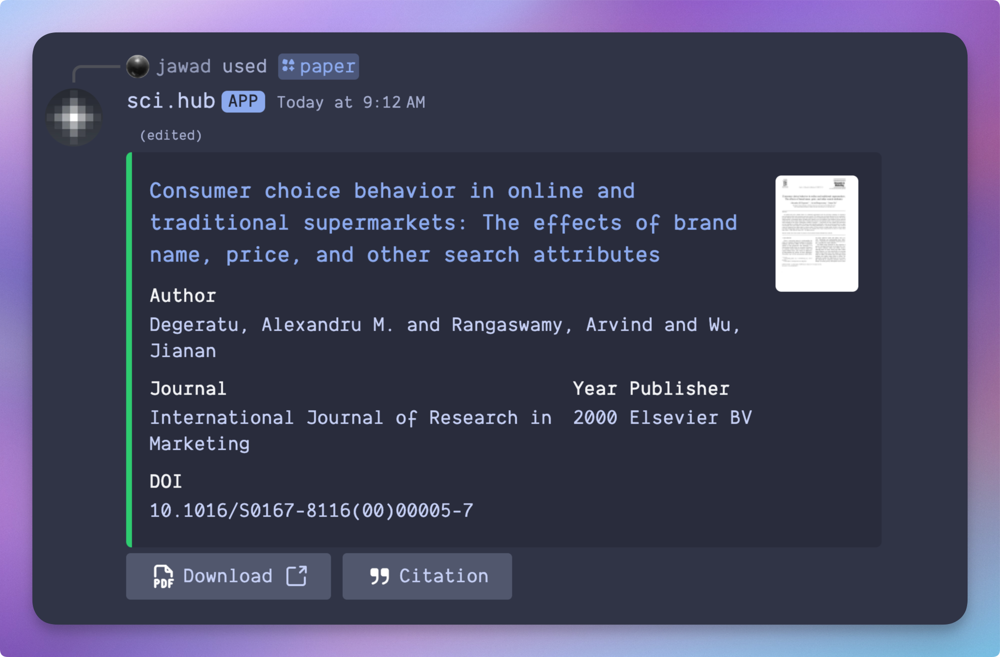

# sci.hub

<div align="center">
  

A Discord bot that retrieves academic papers from Sci-Hub

[](https://discord.com/oauth2/authorize)
[](https://www.python.org)
[](LICENSE)

</div>

## Running Locally

1. Create a virtual environment:

```bash
uv venv
source .venv/bin/activate
```

2. Install dependencies:

```bash
uv pip install -r requirements.txt
```

3. Create a `.env` file with your Discord bot token and Upstash Redis credentials:

```
DISCORD_TOKEN=...
UPSTASH_REDIS_REST_URL=...
UPSTASH_REDIS_REST_TOKEN=...
USE_CACHE=true  # Set to "false" to disable caching
```

4. Run the bot

```bash
python main.py
```

## Usage

The bot provides a single slash command:

-   `/paper <query>`: Retrieves a paper from Sci-Hub using either:
    -   A DOI (e.g. `10.1038/s41586-019-1750-x`)
    -   A URL containing a DOI (e.g. from publisher websites)
